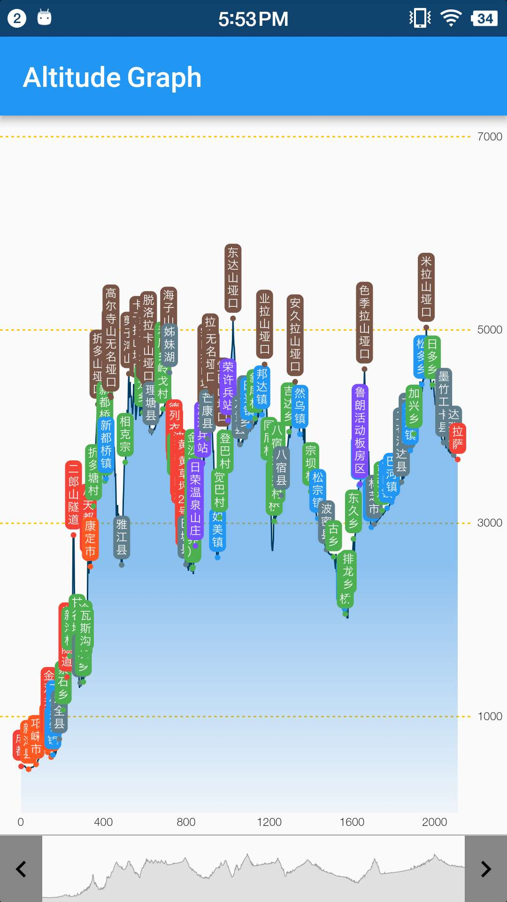
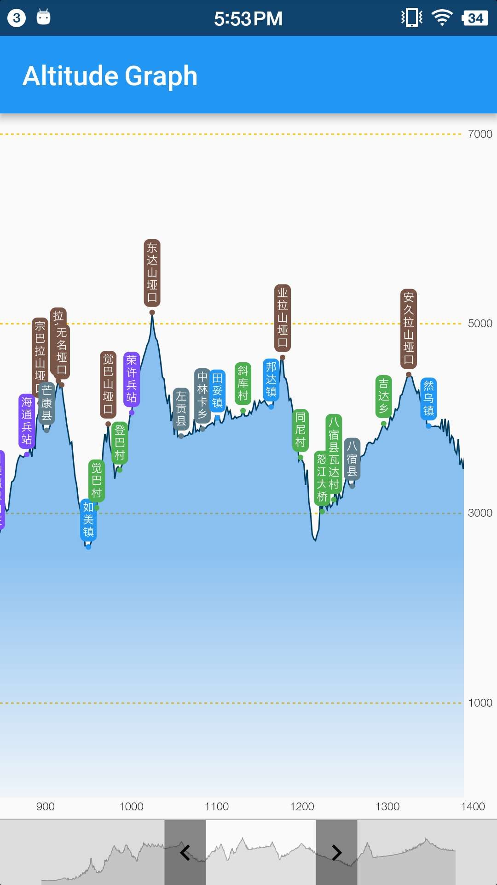

# altitude_graph

A pure Flutter widget to display and interact with a altitude map.

## Features

- Display a powerful altitude graph, it can be displaying over thousand of points
- Provides scaling and scrolling operations with smooth performance
- You can scales, drags on the graph by fingers easily, and also Provide a sliding bar to scaling and scrolling the graph

## Getting Started

see the [example]()

## TODO
- [ ] 支持长按显示指定坐标点的详细信息
- [ ] 支持惯性滑动
- [ ] 解决规律性掉帧的问题
- [ ] 第一次放大时卡顿, 底部ControlBar 滑钮从两边往中间拖动时尤其明显

# License
altitude_graph is licensed under the Apache License 2.0. See the [LICENSE](LICENSE) file.

# About Flutter
For help getting started with Flutter, view flutter online
[documentation](https://flutter.io/).
