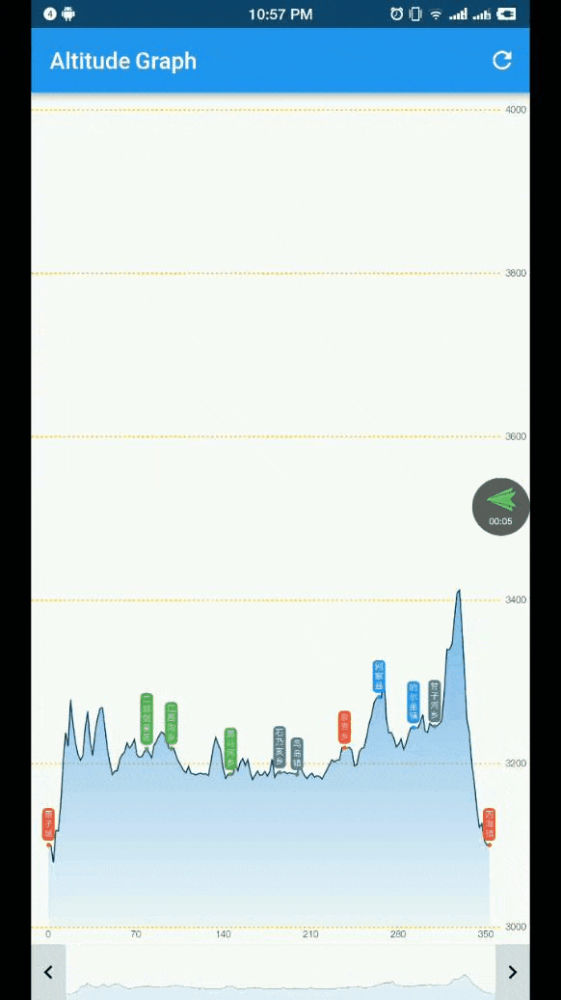

# altitude_graph

A pure Flutter widget to display and interact with an altitude graph.

## Features

- Display a powerful altitude graph it composed by over thousand of points
- Provides scaling and scrolling operations with smooth performance
- You can scale, drag on the graph by fingers, and beside of this I also provided a sliding bar on the bottom of the widget that can be scaling and scrolling more easier

## Getting Started

see the [example](./lib/main.dart)

## TODO
- [ ] 支持长按显示指定坐标点的详细信息
- [ ] 放大到一定倍数后变得非常卡顿

# License
altitude_graph is licensed under the Apache License 2.0. See the [LICENSE](LICENSE) file.

# About Flutter
For help getting started with Flutter, view flutter online
[documentation](https://flutter.io/).
